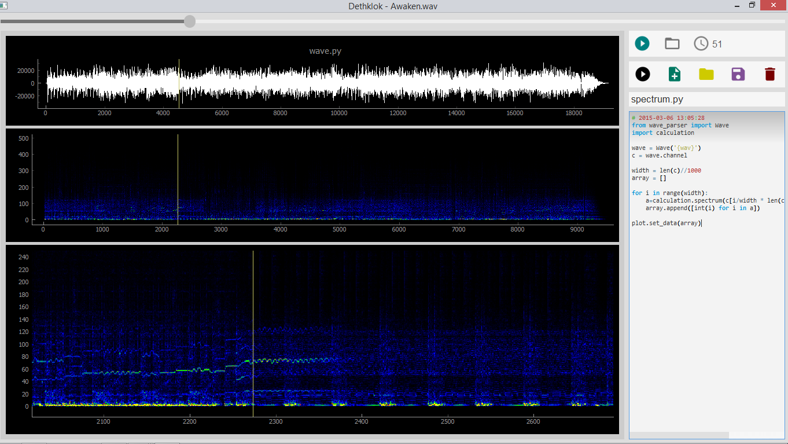

<h2>Визуализатор алгоритмов преобразования звука</h2>

<h3>Суть</h3>

Верхее правое меню служит для открытия, остановки и воспроизведения аудио-трека.

Меню расположенное ниже позволяет:
  <ul> 
    <li>выполнять открытый скрипт;</li>
    <li>создавать новые скрипты;</li>
    <li>открывать уже написанные скрипты;</li>
    <li>сохранять открытые скрипты;</li>
    <li>закрывать открытые скрипты.</li>
  </ul>

<h3>Написание скрипта</h3>

Для написания алгоритма перобразования аудио-трека используется Python 3.x.

В скрипте можно использовать сокращение обозначение расположения загруженного трека - {wav}.

Аудио-файл загружается в создаваемый экземпляр класса Wave из модуля wave_parser. В конструктор класса передаётся путь до wav-файла. 
wave = Wave('{wav}')

Доступ к первому каналу можно получить через поле channel. 
Доступ к произвольному каналу можно получить через метод get_channel, передав значением номер запрашиваемого канала. Нумерация каналов начинает с 0. 
Количество каналов хранится в поле count_channels. 
Запросить нормлализированный канал(значения будут содержаться в промежутке от -1 до 1) можно через метод normalized_channel. Метод принемает параметрон номер канала.

Переданный скрипт выполняется в <b><a href="https://docs.python.org/3/library/functions.html#exec">exec</a></b>(так что не выстрелите себе в ногу) и выполняется в отдельном потоке. 
Данные передаются, форме в соответстующей размерности графика, в функцию <b>plot.set_data</b>

<b>Каждому скрипту соответствует единственный график.</b> График может быть либо 2D, либо 3D. 
3D графики выводятся в виде <a href="https://en.wikipedia.org/wiki/Heat_map">тепловой карты</a>.

<h3>Скриншот</h3>

<h4>Зависит от модулей:</h4>
<ul>
 <li>PyQt5 - графический интерфейс</li>
 <li>Numpy - перобразование wav файлов(спект, кепстр и тд)</li>
 <li>PyQtGraph - постоение графиков</li>
</ul>
